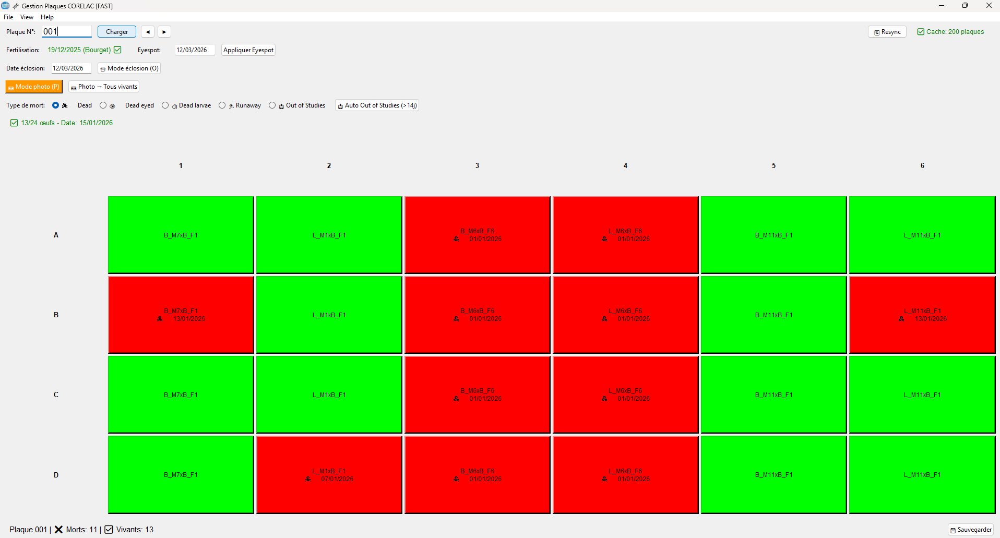

# TOOL - CORELAC Utilities

Python repository for CORELAC plate management, plate plan generation/verification, and Excel/Nextcloud utilities.

## Requirements
- Recommended Python version: `3.12` (project baseline).

## Installation

### Create virtual environment
```bash
python -m venv .venv
```

### Activate environment

**Windows PowerShell:**
```powershell
.\.venv\Scripts\Activate.ps1
```

**Windows CMD:**
```cmd
.\.venv\Scripts\activate.bat
```

**Git Bash (Windows) / Linux / Mac:**
```bash
source .venv/Scripts/activate  # Windows Git Bash
source .venv/bin/activate      # Linux/Mac
```

### Install dependencies
```bash
pip install -r requirements.txt
```

## Quick Start (what to run)
- Main application (plate management): `python src/app/plates_manager.py`
- Plate plan generation: `python src/plate_layout/generate_sequential_female_plate_layout.py`
- Plan verification and reports: `python src/plate_layout/verify_sequential_female_plate_layout.py`
- Nextcloud QR generation (popup/env auth): `python src/nextcloud_qr/automat_link.py`

## Preview


## Project Layout
- `assets/icons/`: application icons (`.ico`, `.png`).
- `dist/`: built Windows executable (if produced).
- `examples/`: sample Excel plates.
- `src/`: application source code.

## Main Scripts
- `src/app/plates_manager.py`: main plate management app.
- `src/plate_layout/generate_sequential_female_plate_layout.py`: generates plate Excel files.
- `src/plate_layout/verify_sequential_female_plate_layout.py`: verification and distribution reports.
- `src/excel_processing/*.py`: batch plate-file edits and Word printing.
- `src/nextcloud_qr/*.py`: link/QR generation and Nextcloud automation.

## Configuration
Most scripts use absolute paths near the top of each file. Update `CONFIG` blocks before execution.

For `src/nextcloud_qr/automat_link.py`, set at least:

```powershell
$env:NEXTCLOUD_USERNAME="your_login"
$env:NEXTCLOUD_PASSWORD="your_token_or_password"
```

## Nextcloud QR Help (`automat_link.py`)
Recommended workflow to generate QR codes with temporary access:

1. In Nextcloud, go to `Settings` > `Security`.
2. Create an `app password` token, for example `qr_generation_temp`.
3. Run the script, then complete the popup fields:

```powershell
$env:NEXTCLOUD_USERNAME="your_login"
$env:NEXTCLOUD_PASSWORD="your_app_token"
python "src/nextcloud_qr/automat_link.py"
```

4. Verify that QR files and CSV are generated in the configured output folder.
5. Revoke the app token in `Settings` > `Security` once generation is complete.

Important: do not store tokens in source code.

## Development Support
This repository benefited from AI-assisted support for syntax optimization and documentation.

## License
This project is licensed under the GNU General Public License v3.0 (GPL-3.0).
See `LICENSE`.
